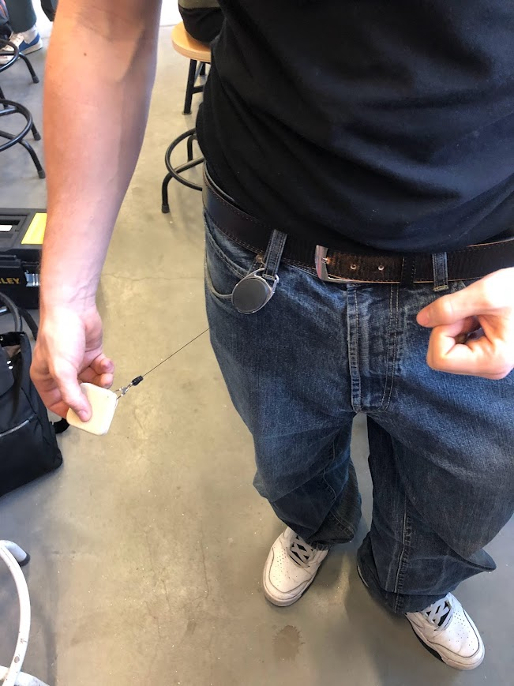

# TreeSync
*Een speelbos met een open plek in het midden dat omgevormd wordt naar een slim speelbos aan de hand van TreeSync.* 

*Projectteam: Warre De Vriendt; Kasper Stas*

24/01/2024

## Samenvatting
De dag van vandaag spelen kinderen niet meer zo veel buiten. Ze zitten meer en meer vast aan het scherm. Aan de hand van enkele interviews blijkt dat kinderen in een schoolweek gemiddeld twee keer een buitenactiviteit doen. Dit is over het algemeen niet super veel.

Het doel van dit project is om deze kinderen weer meer met de natuur en het buitenzijn te herenigen aan de hand van slimme producten. TreeSync tovert een normaal bos om naar een slim bos. Er wordt een speelpleintje in het midden van het bos voorzien met hierbij een kiosk, deze kiosk is de verzamelplaats van alle uitleg/spelletjes.

Ook is gebleken dat kinderen liever een product gebruiken dan een app, dus is er gekozen voor een smartphone vrije aanpak. In deze kiosk zit een tal van spelletjes die kinderen op het speelpleintje en in het bos kunnen spelen. Bij deze spelletjes wordt er ook nog eens onderscheid gemaakt tussen spelletjes met een extra device en spelletjes zonder een extra device. De extra devices zijn verkrijgbaar in de achterkant van de kiosk. Deze zorgen voor een meer uitgebreide speelervaring. Ook zijn het bos en het speelpleintje voorzien van een tal van sensoren, scoreborden, speakers, verlichting, lasers… Deze worden voorzien door ze in de bomen op te hangen.

Aan de hand van deze producten is het de bedoeling om kinderen meer te verleiden om buiten te spelen.

<table border="1">
    <tr>
        <td>Extra device:</td>
        <td>Boom device:</td>
    </tr>
    <tr>
        <td></td>
        <td> </td>
    </tr>
</table>

## Introductie
Een groot hedendaags probleem is dat kinderen te weinig buitenspelen. Uit onderzoek blijkt dat in 2019 maar liefst 70% minder kinderen op straat
speelden dan in 1983 (Van Acker, 2022). Dit is een aanzienlijk groot verschil. Wat hier een grote impact op heeft is de plaats waar kinderen wonen. Veel kinderen hebben geen
plaats in de buurt waar ze kunnen buitenspelen en daar willen wij verandering
in maken. Met ons project willen we de kinderen die geen plaats
hebben om buiten te spelen dit wel geven, en de kinderen die gewoon
buitenspelen beu zijn uitdagen om op een meer creatieve manier buiten te spelen
aan de hand van nieuwe producten. Uit interviews blijkt dat kinderen liever
zonder hun gsm buiten spelen en met een product, hier zijn wij zelf ook
voorstander van. Op die manier hebben de kinderen minder afleiding tijdens het spelen en kunnen de kinderen uit armere wijken zonder gsm niet uitgesloten worden. Het doel is
om een groot aanbod aan verschillende spelletjes en sporten voorzien met een
onderverdeling in verschillende categorieën. Op deze manier kunnen meerdere
vriendengroepen tegelijk of samen spelen zonder last te hebben van elkaar.

## Methdologie

Er is gebruikgemaakt van de double diamond methode. Hierboven ziet u de tijdlijn van het proces. Er werd begonnen met de vraag: Hoe kunnen we slimme producten gebruiken om vriendengroepen samen naar buiten te krijgen om in de natuur te spelen? Met hierin genoeg variatie om ze niet te laten vervelen. 

Eerst werd er gedivergeerd en onderzoek gedaan. Er werd vooral onderzoek gedaan naar benchmarks. Wat bestaat er al om kinderen meer naar buiten te krijgen aan de hand van slimme producten? Er werden ook interviews gedaan om te zien hoeveel kinderen al buiten komen, of ze dit überhaupt zien zitten om met slimme producten te doen, wat ze allemaal leuk vinden bij het buitenspelen, etc. Uit deze informatie werden ideeën gegenereerd en werd er gekeken wat goede en haalbare oplossingen waren. Daarna werd er gedefinieerd, er is voor 1 oplossing gekozen en daar wordt verder meegewerkt. We noemen de oplossing TreeSync. De volgende fase is de prototype fase. Eerst hebben we gekeken wat er geprototyped kan worden. Nadat dit gebeurd was konden we beginnen met het langzaam opbouwen van de prototypes. Op die manier zijn we erin geslaagd om al op enkele domeinen een prototype te maken. Bij de extra speel devices is het meeste al geprototyped en door gebruikerstesten gegaan. Op 1 december werd het beste prototype gekozen (het tweede keer definiëren), om dan met het gekozen ontwerp de tweede fase in te stappen. We zitten nu met een paar prototypes die door één wave zijn gegaan en één prototype dat door twee waves is gegaan. Met deze prototypes gaan we verder in het tweede semester.

## Discovery

### Doestellingen
Doelstellingen
Voordat er onderzoek werd gedaan was de ontwerpopdracht geherformuleerd naar “Hoe kunnen we slimme producten gebruiken om vriendengroepen samen naar buiten te krijgen om in de natuur te spelen met hierin genoeg variatie om ze niet te laten vervelen?”. Dit werd aan de hand van enkele vragen nog meer verduidelijkt. 

Welke producten bestaan al voor dit probleem? 
Wat is het probleem met deze producten? 
Hoe vaak komen kinderen buiten? 
Willen kinderen buitenspelen met slimme producten? 
Spelen kinderen soms al buiten met slimme producten? 
Welke spelletjes spelen kinderen graag?

Met een antwoord op deze zes vragen zou het prototypen kunnen beginnen om tot het uiteindelijke product te komen.

### Materiaal & methoden
In de discovery fase is er gebruik gemaakt van enkele methodologieën om te onderzoeken. Zo zijn de gebruikersnoden aan de hand van interviews ontrafeld. In totaal zijn er vier interviews afgenomen. De leeftijd van de geïnterviewde personen was tussen de tien en veertien jaar. Deze interviews zijn vooraf bedacht en zo opgesteld dat we antwoorden kunnen verkrijgen op onze onderzoeksvragen. Deze vragen waren onder andere:
Hoeveel keer per week kom je buiten met je vrienden?
<ul>
  <li>Heb je al met slimme producten gespeeld?</li>
  <li>Zou je liever met een app of met een product spelen</li>
  <li>Heb je liever een competitief spel of een niet competitief spel?</li>
</ul>

Om de huidige markt beter te leren kennen is er een benchmark gedaan naar slimme producten om buiten te spelen. Deze oplossingen zijn dan ontleed om de problemen ervan te vinden. Het oplossen van deze problemen geeft dan de mogelijkheid voor ons om het te verbeteren.

### Resultaten
Uit de interviews zijn enkele conclusies getrokken. Kinderen spelen gemiddeld maar twee keer in de schoolweek buiten. Dit vinden ze zelf ook te weinig en zijn dus gemotiveerd om meerdere keren naar buiten te komen. Ook waren drie van de vier kinderen al vertrouwd met het buitenspelen met slimme producten. Lasershooting en jachtseizoen waren hierbij het bekendst. De kinderen hadden ook aangegeven dat ze het aantrekkelijker vonden om met een product buiten te spelen in plaats van een app. Dit is onder andere omdat een app op je smartphone is. Dit kan afleidend zijn tijdens het spelen e.g. meldingen. Ook hebben kinderen die nog niet oud genoeg zijn of het financieel niet makkelijk hebben vaak geen smartphone. 

Competitiviteit is ook populairder bij de kinderen. Dit stimuleert hen om samen met vrienden een spel te spelen. Omdat de slimme producten voor meer interactiviteit kunnen zorgen en meerdere soorten spelletjes die je kan spelen valt dit ook in de smaak bij de kinderen.

Bij de benchmark is te zien dat veel van de producten gemaakt zijn voor een smartphone. Ook zijn niet alle buitenactiviteiten met de smartphone, zoals Pokémon GO, om met meerdere personen samen te spelen.

### Conclusies & implicaties
Uit al deze resultaten en onderzoeken kan vastgesteld worden dat het product smartphone vrij zal zijn. Zo is het ook bereikbaar voor ieder kind dat buiten wil spelen met vrienden zonder dat ze een smartphone nodig hebben. Dit is ook veiliger omdat tijdens het spelen een smartphone makkelijk kapot gaat.

Kinderen komen niet meer genoeg met de natuur in contact. Omdat de natuur een belangrijk element is in de ontwikkeling moet dit opnieuw gestimuleerd worden. Door competitiviteit zijn kinderen gemotiveerder om elkaar uit te dagen en een spel te spelen. 

Dit zorgt voor enkele nieuwe vragen:
<ul>
  <li>Hoe kan een kind weer meer met de natuur in contact komen?</li>
  <li>Hoe integreren we een slim product zonder gebruik te maken van een smartphone?</li>
  <li>Hoe voegen we competitiviteit toe aan het product?</li>
</ul>

## Definition

### Doestellingen
In de vorige fase zijn heel wat nieuwe vragen opgewekt. Met deze definition fase zouden we op deze vragen een antwoord willen verkrijgen om zo het prototypen te kunnen starten.

### Materiaal & methoden
In deze fase van het ontwerpproces is er gebruikgemaakt van het WWWWH model en de problem solution matrix. Laten we beginnen met het WWWWH model.

Who:
De doelgroep van dit product zijn kinderen tussen de 10 en 15 jaar.

Where:
Dit is voor huishoudens waar er meer slimme producten aanwezig zijn. 

When:
Wanneer de kinderen een vrij moment hebben en zin om buiten te komen

Why:
Kinderen gaan veel rapper online games spelen, video’s kijken, op instagram scrollen,... Dit zorgt ervoor dat ze weinig buiten komen. Ook zal het de sociale ontwikkeling van de kinderen negatief beïnvloeden.
 
How many:
Miljoenen kinderen en jongeren

Naast dit WWWWH model is een problem-solution matrix gebruikt om de problemen in kaart te brengen. 

Wat zijn op dit moment de problemen?
Kinderen komen veel te weinig buiten en als ze al buiten komen zijn ze het rap beu. Dit zorgt ervoor dat kinderen hun sociale batterij niet genoeg ontwikkelen. Als er meer naar de jongeren gekeken wordt, wordt opgemerkt dat ze te afhankelijk worden van hun smartphone en niet meer zonder kunnen. Ook is de kennis over de natuur zeer schaars.

Bestaande oplossingen?
Uit een benchmark zijn er al heel wat bestaande oplossingen. Zo bestaan er al een tal van apps om kinderen buiten een spel te laten spelen. Denk maar aan Pokémon GO, Jachtseizoen of GeoCache. Het probleem is dat de kinderen hierdoor wel weer vastgekluisterd zijn aan hun scherm. Ook bestaat er een app Pleintje waarop allemaal spelletjes staan om buiten te spelen zoals verstoppertje. De winnaar krijgt dan punten die uitgegeven kunnen worden om een coole avatar te maken. Veel jongere kinderen hebben nog geen smartphone wat ervoor zorgt dat dit pas vanaf latere leeftijd gebruikt kan worden. Een andere oplossing is de Garmin Vivofit Junior 3. Dit spoort de gebruiker aan om meer te bewegen. Er bestaat hiervan geen functie om dit samen met vrienden te doen, wat, zoals uit de interviews gebleken, minder tof is voor kinderen.

Niet bestaande oplossingen?
Een mogelijke oplossing voor deze problemen is een buitenspeelbril. Naast deze buitenspeelbril is het mogelijk om een ander soort toestel te hebben waardoor de kinderen buiten met elkaar een tal van spelletjes kunnen spelen aan de hand van dit toestel. Naast deze twee oplossingen is er nog een extremere oplossing, een chip in het brein om meer buiten te spelen. Bij de problem-solution matrix werd er nog geen onderscheid gemaakt tussen mogelijke en onmogelijke oplossingen. Geen enkel idee was te zot voor woorden.

### Resultaten
Deze twee methodes onthulden belangrijke inzichten. Het WWWWH model gaf meer duidelijkheid over de doelgroep. Kinderen van 10-15 jaar. 

De problem solution matrix bracht de problemen in kaart. De voornaamste problemen met de bestaande oplossing is dat er vooral met een smartphone gewerkt wordt. Om hierop in te spelen gaan we, zoals bij de discovery fase gezegd, voor een smartphone vrije aanpak. 

### Conclusies & implicaties
Door het product smartphone vrij te maken is er een apart toestel nodig. Dit is in de vorm van een kiosk die aan het speelpleintje zal staan. Deze kiosk bevat alle spelletjes en daarbij nog eens een aantal extra toestellen. Deze extra toestellen zorgen ervoor dat de kinderen spelletjes kunnen spelen zoals bosstratego zonder dat ze zelf speelkaarten moeten voorzien. Door de bomen uit te rusten met apparaten die in het bezit zijn van enkele sensoren, lichtjes en een luidspreker zijn er zeer veel spelopties mogelijk. 

Deze kleine extra apparaten zijn in prototype proces. Zo werden er enkele vormen van schuim en hout gemaakt. Drie ervan zijn het formaat van een horloge (ronde vorm, vierkant en rechthoek). Een andere is het formaat van een smartphone. Na enkele interviews en testen blijkt dat het kleine vierkante formaat het best was. Deze hebben we dan aan een uitrolbaar touw gehangen om het zo makkelijk aan je broek te hangen. Nu kunnen de kinderen het niet snel kwijtraken maar toch rap bij de hand hebben.

<table border="1">
    <tr>
        <td>Extra devices prototypes:</td>
        <td>Extra device groot prototype:</td>
    </tr>
    <tr>
        <td></td>
        <td> </td>
    </tr>
</table>

Voor de andere apparatuur zoals de toestellen in de bomen en het scorebord/de bediening daarvan zijn er eerste fase prototypes. Deze zijn klaar om het volgende semester meteen te testen.

<table border="1">
    <tr>
        <td>Scorebord bediening schets:</td>
        <td>Scorebord bediening prototype:</td>
    </tr>
    <tr>
        <td></td>
        <td> </td>
    </tr>
</table>

Van de interface van de kiosk is er een schema gemaakt over hoe dit eruit zou zien. Na het schema uit te tekenen, aan te passen waar nodig en te verbeteren is deze interface gemaakt in protopie. Net zoals de andere apparatuur zal deze bij de start van het volgende semester meteen getest kunnen worden. Dit zal gebeuren door een tablet in een doos te plakken om de kiosk te simuleren en de gebruiker zonder enige aanwijzing enkele opdrachten te laten uitvoeren. Een van deze opdrachten zou kunnen zijn ”Ga naar de contactform en vul deze in” of “Ga naar de lijst met spelletjes met extra devices en kom te weten wat extra devices zijn”. De testers kunnen dan luidop zeggen wat ze denken. Deze realtime feedback helpt dan ook om de interface te optimaliseren. 

Schema interface:

Prototype interface in protopie:

Aangezien ons product niet vasthangt aan een paar spelletjes is het mogelijk om dit regelmatig te updaten met nieuwe soorten spelletjes.

## Develop 1
### Doelstellingen
tekst over de doelstellingen
### Materiaal en methoden
#### Anthropometrische analyse
tekst over de analyse
### Resultaten
### Conclusies en implicaties

## Bill of materials
<ul>
    <li>Arduino</li>
    <li>NFC sensor arduino</li>
    <li>NFC tags</li>
    <li>Arduino laser</li>
    <li>Arduino lamp</li>
    <li>Hout</li>
    <li>Karton</li>
    <li>Tablet</li>
</ul>

## Kritische reflectie

### Gebruikersfeedback

Er zijn slechts vier interviews uitgevoerd met kinderen tussen de tien en veertien jaar oud. Dit aantal kan mogelijk te beperkt zijn om een representatief beeld te krijgen van de doelgroep. We zouden het aantal interviews moeten vergroten om een breder scala aan meningen en behoeften te verzamelen.

### Diepgaander begrip van de problemen
Hoewel de interviews en benchmarking enkele belangrijke inzichten hebben opgeleverd, zou een meer diepgaande analyse van de onderliggende redenen waarom kinderen niet buiten spelen en waarom bestaande oplossingen niet werken, nuttig kunnen zijn. Het identificeren van diepere oorzaken kan helpen bij het ontwikkelen van effectievere oplossingen.

### Evolutie van prototypen
Het is goed dat er wordt gewerkt aan prototypes, maar er moet aandacht worden besteed aan het iteratieve proces en de evolutie van de prototypen. Er moet voor gezorgd worden dat de feedback van gebruikers wordt geïntegreerd om de prototypes continu te verbeteren en aan te passen. Dit zou een pingpong proces moeten zijn

### Duurzaamheid en onderhoud
In de verdere ontwikkeling van het project kan er aandacht besteed worden om het speelbos zo duurzaam mogelijk aan te passen. Hoe wordt ervoor gezorgd dat de technologische aspecten langdurig functioneel blijven, en hoe wordt duurzaamheid geïntegreerd in het ontwerp? Dit zijn belangrijke vragen voor het duurzame aspect.

### Budget en haalbaarheid
Hoewel er een lijst is van materialen zoals Arduino en NFC-sensoren, ontbreekt informatie over het budget en de algehele haalbaarheid van het project. Het is belangrijk om realistisch te zijn over de beschikbare middelen en te zorgen voor een kosteneffectieve implementatie.

### Documentatie en verslaglegging
Er moet voor gezorgd worden dat er meer wordt gedocumenteerd. De kleinste dingen die gedaan en bedacht worden moeten neergeschreven worden. Dit is beter voor de documentatie en om informatie op te nemen voor lezers.

## Bronnen
Van Acker, R. (2022). Onderzocht: waarom spelen kinderen niet meer buiten? Geraadpleegd op 17 oktober 2023 via https://www.gezondleven.be/nieuws/onderzocht-waarom-spelen-onze-kinderen-niet-meer-buiten#:~:text=Sommige%20kinderen%20in%20deze%2021,cognitieve%20ontwikkeling%20van%20onze%20kinderen

## Bijlagen
Miro bord: https://miro.com/app/board/uXjVNZS7Mho=/?share_link_id=664656507937
