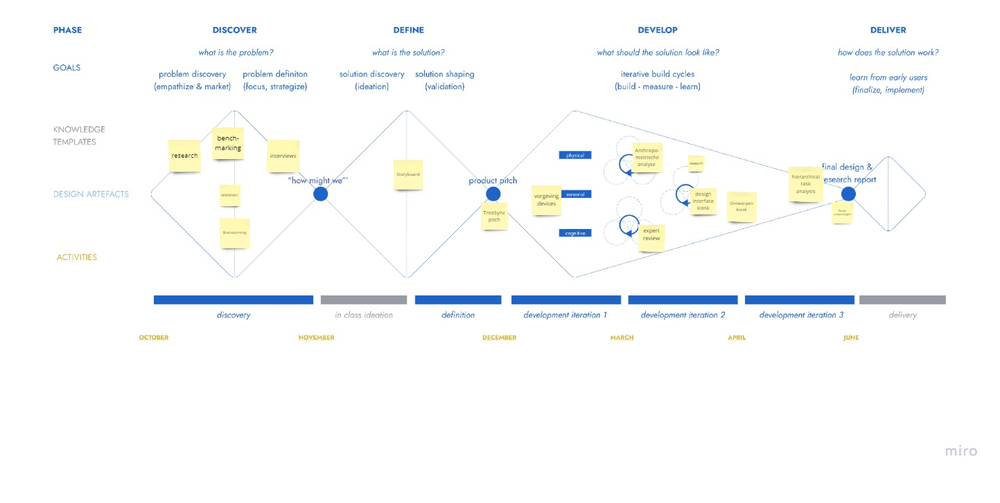

# TreeSync
*Een speelbos met een open plek in het midden dat omgevormd wordt naar een slim speelbos aan de hand van TreeSync.* 

*Projectteam: Warre De Vriendt; Kasper Stas*

24/01/2024

## Samenvatting
De dag van vandaag spelen kinderen niet meer zo veel buiten. Ze zitten meer en meer vast aan het scherm. Aan de hand van enkele interviews blijkt dat kinderen in een schoolweek gemiddeld twee keer een buitenactiviteit doen. Dit is over het algemeen niet super veel.

Het doel van dit project is om deze kinderen weer meer met de natuur en het buitenzijn te herenigen aan de hand van slimme producten. TreeSync tovert een normaal bos om naar een slim bos. Er wordt een speelpleintje in het midden van het bos voorzien met hierbij een kiosk, deze kiosk is de verzamelplaats van alle uitleg/spelletjes.

Ook is gebleken dat kinderen liever een product gebruiken dan een app, dus is er gekozen voor een smartphone vrije aanpak. In deze kiosk zit een tal van spelletjes die kinderen op het speelpleintje en in het bos kunnen spelen. Bij deze spelletjes wordt er ook nog eens onderscheid gemaakt tussen spelletjes met een extra device en spelletjes zonder een extra device. De extra devices zijn verkrijgbaar in de achterkant van de kiosk. Deze zorgen voor een meer uitgebreide speelervaring. Ook zijn het bos en het speelpleintje voorzien van een tal van sensoren, scoreborden, speakers, verlichting, lasers… Deze worden voorzien door ze in de bomen op te hangen.

Aan de hand van deze producten is het de bedoeling om kinderen meer te verleiden om buiten te spelen.

<table border="1">
    <tr>
        <td>Boom device:</td>
        <td>Kiosk:</td>
    </tr>
    <tr>
        <td></td>
        <td> </td>
    </tr>
</table>

[](https://youtu.be/m9WB8esa1qU)

## Introductie
Een groot hedendaags probleem is dat kinderen te weinig buitenspelen. Uit onderzoek blijkt dat in 2019 maar liefst 70% minder kinderen op straat
speelden dan in 1983 (Van Acker, 2022). Dit is een aanzienlijk groot verschil. Wat hier een grote impact op heeft is de plaats waar kinderen wonen. Veel kinderen hebben geen
plaats in de buurt waar ze kunnen buitenspelen en daar willen wij verandering
in maken. Met ons project willen we de kinderen die geen plaats
hebben om buiten te spelen dit wel geven, en de kinderen die gewoon
buitenspelen beu zijn uitdagen om op een meer creatieve manier buiten te spelen
aan de hand van nieuwe producten. Uit interviews blijkt dat kinderen liever
zonder hun gsm buiten spelen en met een product, hier zijn wij zelf ook
voorstander van. Op die manier hebben de kinderen minder afleiding tijdens het spelen en kunnen de kinderen uit armere wijken zonder gsm niet uitgesloten worden. Het doel is
om een groot aanbod aan verschillende spelletjes en sporten voorzien met een
onderverdeling in verschillende categorieën. Op deze manier kunnen meerdere
vriendengroepen tegelijk of samen spelen zonder last te hebben van elkaar.


## Methodologie


Er is gebruikgemaakt van de triple diamond methode. Hierboven ziet u de tijdlijn van het proces. Er werd begonnen met de vraag: Hoe kunnen we slimme producten gebruiken om vriendengroepen samen naar buiten te krijgen om in de natuur te spelen? Met hierin genoeg variatie om ze niet te laten vervelen. 

Eerst werd er gedivergeerd en onderzoek gedaan. Er werd vooral onderzoek gedaan naar benchmarks. Wat bestaat er al om kinderen meer naar buiten te krijgen aan de hand van slimme producten? Er werden ook interviews gedaan om te zien hoeveel kinderen al buiten komen, of ze dit überhaupt zien zitten om met slimme producten te doen, wat ze allemaal leuk vinden bij het buitenspelen, etc. Uit deze informatie werden ideeën gegenereerd en werd er gekeken wat goede en haalbare oplossingen waren. Daarna werd er gedefinieerd, er is voor 1 oplossing gekozen en daar wordt verder meegewerkt. We noemen de oplossing TreeSync. De volgende fase is de prototype fase. Eerst hebben we gekeken wat er geprototyped kan worden. Nadat dit gebeurd was konden we beginnen met het langzaam opbouwen van de prototypes. Op die manier zijn we erin geslaagd om al op enkele domeinen een prototype te maken. Bij de extra speel devices is het meeste al geprototyped en door gebruikerstesten gegaan. Op 1 december werd het beste prototype gekozen (het tweede keer definiëren), om dan met het gekozen ontwerp de tweede fase in te stappen. We zitten nu met een paar prototypes die door één wave zijn gegaan en één prototype dat door twee waves is gegaan. Met deze prototypes gaan we verder in het tweede semester.


In het tweede semester gebruiken we nieuwe methodologieën voor het uitvoeren van testen, waaronder een heuristische evaluatie gebaseerd op Nielsen's heuristieken. Deze set van tien principes, ontwikkeld door Jakob Nielsen, helpt veelvoorkomende gebruiksproblemen te identificeren. Het gebruik van Nielsen's heuristieken in ons ontwerpproces biedt een gestructureerde benadering, verhoogt de bruikbaarheid en gebruikerservaring, en identificeert problemen.

## Discovery

### Doestellingen
Doelstellingen
Voordat er onderzoek werd gedaan was de ontwerpopdracht geherformuleerd naar “Hoe kunnen we slimme producten gebruiken om vriendengroepen samen naar buiten te krijgen om in de natuur te spelen met hierin genoeg variatie om ze niet te laten vervelen?”. Dit werd aan de hand van enkele vragen nog meer verduidelijkt. 

Welke producten bestaan al voor dit probleem? 
Wat is het probleem met deze producten? 
Hoe vaak komen kinderen buiten? 
Willen kinderen buitenspelen met slimme producten? 
Spelen kinderen soms al buiten met slimme producten? 
Welke spelletjes spelen kinderen graag?

Met een antwoord op deze zes vragen zou het prototypen kunnen beginnen om tot het uiteindelijke product te komen.

### Materiaal & methoden
In de discovery fase is er gebruik gemaakt van enkele methodologieën om te onderzoeken. Zo zijn de gebruikersnoden aan de hand van interviews ontrafeld. In totaal zijn er vier interviews afgenomen. De leeftijd van de geïnterviewde personen was tussen de tien en veertien jaar. Deze interviews zijn vooraf bedacht en zo opgesteld dat we antwoorden kunnen verkrijgen op onze onderzoeksvragen. Deze vragen waren onder andere:
Hoeveel keer per week kom je buiten met je vrienden?
<ul>
  <li>Heb je al met slimme producten gespeeld?</li>
  <li>Zou je liever met een app of met een product spelen</li>
  <li>Heb je liever een competitief spel of een niet competitief spel?</li>
</ul>

Om de huidige markt beter te leren kennen is er een benchmark gedaan naar slimme producten om buiten te spelen. Deze oplossingen zijn dan ontleed om de problemen ervan te vinden. Het oplossen van deze problemen geeft dan de mogelijkheid voor ons om het te verbeteren.

### Resultaten
Uit de interviews zijn enkele conclusies getrokken. Kinderen spelen gemiddeld maar twee keer in de schoolweek buiten. Dit vinden ze zelf ook te weinig en zijn dus gemotiveerd om meerdere keren naar buiten te komen. Ook waren drie van de vier kinderen al vertrouwd met het buitenspelen met slimme producten. Lasershooting en jachtseizoen waren hierbij het bekendst. De kinderen hadden ook aangegeven dat ze het aantrekkelijker vonden om met een product buiten te spelen in plaats van een app. Dit is onder andere omdat een app op je smartphone is. Dit kan afleidend zijn tijdens het spelen e.g. meldingen. Ook hebben kinderen die nog niet oud genoeg zijn of het financieel niet makkelijk hebben vaak geen smartphone. 

Competitiviteit is ook populairder bij de kinderen. Dit stimuleert hen om samen met vrienden een spel te spelen. Omdat de slimme producten voor meer interactiviteit kunnen zorgen en meerdere soorten spelletjes die je kan spelen valt dit ook in de smaak bij de kinderen.

Bij de benchmark is te zien dat veel van de producten gemaakt zijn voor een smartphone. Ook zijn niet alle buitenactiviteiten met de smartphone, zoals Pokémon GO, om met meerdere personen samen te spelen.

### Conclusies & implicaties
Uit al deze resultaten en onderzoeken kan vastgesteld worden dat het product smartphone vrij zal zijn. Zo is het ook bereikbaar voor ieder kind dat buiten wil spelen met vrienden zonder dat ze een smartphone nodig hebben. Dit is ook veiliger omdat tijdens het spelen een smartphone makkelijk kapot gaat.

Kinderen komen niet meer genoeg met de natuur in contact. Omdat de natuur een belangrijk element is in de ontwikkeling moet dit opnieuw gestimuleerd worden. Door competitiviteit zijn kinderen gemotiveerder om elkaar uit te dagen en een spel te spelen. 

Dit zorgt voor enkele nieuwe vragen:
<ul>
  <li>Hoe kan een kind weer meer met de natuur in contact komen?</li>
  <li>Hoe integreren we een slim product zonder gebruik te maken van een smartphone?</li>
  <li>Hoe voegen we competitiviteit toe aan het product?</li>
</ul>

## Definition

### Doestellingen
In de vorige fase zijn heel wat nieuwe vragen opgewekt. Met deze definition fase zouden we op deze vragen een antwoord willen verkrijgen om zo het prototypen te kunnen starten.

### Materiaal & methoden
In deze fase van het ontwerpproces is er gebruikgemaakt van het WWWWH model en de problem solution matrix. Laten we beginnen met het WWWWH model.

Who:
De doelgroep van dit product zijn kinderen tussen de 10 en 15 jaar.

Where:
Dit is voor huishoudens waar er meer slimme producten aanwezig zijn. 

When:
Wanneer de kinderen een vrij moment hebben en zin om buiten te komen

Why:
Kinderen gaan veel rapper online games spelen, video’s kijken, op instagram scrollen,... Dit zorgt ervoor dat ze weinig buiten komen. Ook zal het de sociale ontwikkeling van de kinderen negatief beïnvloeden.
 
How many:
Miljoenen kinderen en jongeren

Naast dit WWWWH model is een problem-solution matrix gebruikt om de problemen in kaart te brengen. 

Wat zijn op dit moment de problemen?
Kinderen komen veel te weinig buiten en als ze al buiten komen zijn ze het rap beu. Dit zorgt ervoor dat kinderen hun sociale batterij niet genoeg ontwikkelen. Als er meer naar de jongeren gekeken wordt, wordt opgemerkt dat ze te afhankelijk worden van hun smartphone en niet meer zonder kunnen. Ook is de kennis over de natuur zeer schaars.

Bestaande oplossingen?
Uit een benchmark zijn er al heel wat bestaande oplossingen. Zo bestaan er al een tal van apps om kinderen buiten een spel te laten spelen. Denk maar aan Pokémon GO, Jachtseizoen of GeoCache. Het probleem is dat de kinderen hierdoor wel weer vastgekluisterd zijn aan hun scherm. Ook bestaat er een app Pleintje waarop allemaal spelletjes staan om buiten te spelen zoals verstoppertje. De winnaar krijgt dan punten die uitgegeven kunnen worden om een coole avatar te maken. Veel jongere kinderen hebben nog geen smartphone wat ervoor zorgt dat dit pas vanaf latere leeftijd gebruikt kan worden. Een andere oplossing is de Garmin Vivofit Junior 3. Dit spoort de gebruiker aan om meer te bewegen. Er bestaat hiervan geen functie om dit samen met vrienden te doen, wat, zoals uit de interviews gebleken, minder tof is voor kinderen.

Niet bestaande oplossingen?
Een mogelijke oplossing voor deze problemen is een buitenspeelbril. Naast deze buitenspeelbril is het mogelijk om een ander soort toestel te hebben waardoor de kinderen buiten met elkaar een tal van spelletjes kunnen spelen aan de hand van dit toestel. Naast deze twee oplossingen is er nog een extremere oplossing, een chip in het brein om meer buiten te spelen. Bij de problem-solution matrix werd er nog geen onderscheid gemaakt tussen mogelijke en onmogelijke oplossingen. Geen enkel idee was te zot voor woorden.

### Resultaten
Deze twee methodes onthulden belangrijke inzichten. Het WWWWH model gaf meer duidelijkheid over de doelgroep. Kinderen van 10-15 jaar. 

De problem solution matrix bracht de problemen in kaart. De voornaamste problemen met de bestaande oplossing is dat er vooral met een smartphone gewerkt wordt. Om hierop in te spelen gaan we, zoals bij de discovery fase gezegd, voor een smartphone vrije aanpak. 

### Conclusies & implicaties
Door het product smartphone vrij te maken is er een apart toestel nodig. Dit is in de vorm van een kiosk die aan het speelpleintje zal staan. Deze kiosk bevat alle spelletjes en daarbij nog eens een aantal extra toestellen. Deze extra toestellen zorgen ervoor dat de kinderen spelletjes kunnen spelen zoals bosstratego zonder dat ze zelf speelkaarten moeten voorzien. Door de bomen uit te rusten met apparaten die in het bezit zijn van enkele sensoren, lichtjes en een luidspreker zijn er zeer veel spelopties mogelijk. 

Deze kleine extra apparaten zijn in prototype proces. Zo werden er enkele vormen van schuim en hout gemaakt. Drie ervan zijn het formaat van een horloge (ronde vorm, vierkant en rechthoek). Een andere is het formaat van een smartphone. Na enkele interviews en testen blijkt dat het kleine vierkante formaat het best was. Deze hebben we dan aan een uitrolbaar touw gehangen om het zo makkelijk aan je broek te hangen. Nu kunnen de kinderen het niet snel kwijtraken maar toch rap bij de hand hebben.

<table border="1">
    <tr>
        <td>Extra devices prototypes:</td>
        <td>Extra device groot prototype:</td>
    </tr>
    <tr>
        <td></td>
        <td> </td>
    </tr>
</table>

Voor de andere apparatuur zoals de toestellen in de bomen en het scorebord/de bediening daarvan zijn er eerste fase prototypes. Deze zijn klaar om het volgende semester meteen te testen.

<table border="1">
    <tr>
        <td>Scorebord bediening schets:</td>
        <td>Scorebord bediening prototype:</td>
    </tr>
    <tr>
        <td></td>
        <td> </td>
    </tr>
</table>

Van de interface van de kiosk is er een schema gemaakt over hoe dit eruit zou zien. Na het schema uit te tekenen, aan te passen waar nodig en te verbeteren is deze interface gemaakt in protopie. Net zoals de andere apparatuur zal deze bij de start van het volgende semester meteen getest kunnen worden. Dit zal gebeuren door een tablet in een doos te plakken om de kiosk te simuleren en de gebruiker zonder enige aanwijzing enkele opdrachten te laten uitvoeren. Een van deze opdrachten zou kunnen zijn ”Ga naar de contactform en vul deze in” of “Ga naar de lijst met spelletjes met extra devices en kom te weten wat extra devices zijn”. De testers kunnen dan luidop zeggen wat ze denken. Deze realtime feedback helpt dan ook om de interface te optimaliseren. 


Schema interface:


Prototype interface in protopie:


Aangezien ons product niet vasthangt aan een paar spelletjes is het mogelijk om dit regelmatig te updaten met nieuwe soorten spelletjes.

## Develop 1
### Doelstellingen
De antropometrie wordt op enkele vlakken getest. Een daarvan is de hoogte van het scherm, de ander is de hoogte van de bediening van het scorebord.

### Materiaal en methoden
Deze hoogte van het scherm werd getest aan de hand van een testprotocol, deze is te vinden op onze miro[^1]. Hierbij staan ook de uitslagen van dit testprotocol. Er wordt gebruik gemaakt van een kartonnen bord met daarop vijf targets. Deze vijf targets dienen om alle uiteinden van het scherm goed mee in rekening te kunnen houden. 

Voor de hoogte van de bediening van het scorebord wordt het prototype met de knoppen op gebruikt. De gebruikers moeten dan hun voorkeur geven aan hoogte waarop dit zou moeten hangen.

#### Anthropometrische analyse
Deze testen worden verwerkt door te kijken welke hoogtes het meest populair waren relatief gezien van de gebruiker. Door deze meting wordt duidelijk dat de onderkant van het scherm op zo'n 20cm vanaf de bovenkant van het hoofd als het best werd beschouwd. Bij de bediening van het scorebord worden de verschillende hoogtes die aangegeven zijn door de gebruikers bekeken. Van deze waarde wordt het gemiddelde genomen.

### Resultaten
Om ervoor te zorgen dat het scherm voor zowel grote kinderen en volwassenen als kleine of jongere kinderen gebruikt kan worden zou er gebruik gemaakt kunnen worden van een trapje. De groep werd opgesplitst van 6 tem 10 jaar en 11 tem 18 jaar. Uit deze twee groepen werd de gemiddelde grootte genomen. Deze grootte is voor de groep van 6 tem 10 jaar 1,29 meter en voor de groep van 11 tem 18 jaar 1,63 meter. Met deze gegevens is in Siemens NX een model getekend dat rekening houdt met de relatieve afstand van ongeveer 20cm vanaf de onderkant van het scherm tot de gemiddelde grootte. 

Het gemiddelde voor de bediening van het scorebord geeft een hoogte van 127cm. Hiernaast werd ook een benchmark gedaan voor de hoogte van een deurbel. Deze gaf aan dat de ideale hoogte 120-130cm is (electro-colli, 2023). Door deze twee infobronnen samen te voegen is de keuze gemaakt om de bediening van het scorebord op een hoogte van 125cm te hangen.


Deze links gaan naar het onderzoeksprotocol en onderzoeksanalyse:
[protocol](https://docs.google.com/document/d/1bPBm9zT4DTrtKLr9F2QQbLYk5rvzX8b78w-nyLWi9Vo/edit?usp=sharing)
[analyse](https://docs.google.com/document/d/1CmB170c9KkNxsDit4ds0lzrzXazLMY2tYkJLyz0bhfM/edit?usp=sharing)

## Develop 2
### Doelstellingen
Om op het einde van de opdracht een zo gebruiksvriendelijk mogelijk ontwerp te maken worden er expert reviews en usability testen uitgevoerd. Deze testen geven meer duidelijkheid over de pijnpunten in het product. Aan de hand van Nielsen's heuristieken wordt er een score gegeven op de functies van het product. Deze scores helpen bij het optimaliseren van het ontwerp.

### Materiaal en methoden
Door middel van figma is er een interface gemaakt. Voor de expert reviews krijgen de gebruikers twee opdrachten die ze moeten volooien. Na het uitvoeren van deze opdrachten krijgen de gebruikers een evaluatieformulier voorgeschoteld. Beide opdrachten hebben aan de hand van Nielsen's heuristieken vragen waarop de gebruiker een score moet geven van 1-5. Hierbij is 1 zeer slecht en 5 zeer goed. 

### Resultaten
Uit de uitgevoerde tests is gebleken dat de interface van de kiosk een heldere en intuïtieve gebruikerservaring biedt. Zonder instructies kunnen gebruikers makkelijk door de verschillende delen van de app navigeren. De integratie van Botty heeft zich bewezen als een waardevol hulpmiddel dat gebruikers effectief door de app leidt, waardoor een vrolijk en speels element aan de beleving wordt toegevoegd, wat met name voor jonge gebruikers een welkome toevoeging vormt.

Ondanks deze positieve bevindingen, zijn er enkele aandachtspunten aan het licht gekomen. Ookaldraagt de aanwezigheid van Botty bij tot een aantrekkelijk ontwerp, wordt opgemerkt dat de kleurensamenstelling enigszins eentonig oogt. Bovendien ontbreekt de interface aan een speels karakter, wat voor een applicatie gericht op kinderen niet de bedoeling is. Een ander aspect dat verbetering behoeft, is de consistentie tussen de pop-upberichten en de rest van de applicatie, aangezien deze momenteel niet op elkaar aansluiten.

Ook is de duidelijkheid van de knoppen binnen de app een pijnpunt. Hoewel gebruikers na verloop van tijd bekend raken met de uniforme vormgeving van de knoppen, valt op dat het in het begin moeilijker is om onderscheid te maken tussen interactieve elementen en statische tekstvakken. 

### Conclusies
Er zijn enkele aandachtspunten die verbetering behoeven. Ondanks dat Botty het ontwerp aantrekkelijker maakt, komt de kleursamenstelling enigszins saai over en mist de interface een speelse uitstraling. Daarnaast zijn de pop-ups niet in lijn met het thema van de app, wat de coherentie verstoort. Dit geeft de aanleiding om de opmaak van de pop-ups te herbekijken. Tot slot worden de knoppen niet als knop beschouwd. Om de knoppen een duidelijker signaal te geven is er voor gekozen om een schaduwrand er aan toe te voegen. Deze schaduwrand geeft de knop een 3d gevoel wat gebruikers rapper gaat vertellen dat ze indrukbaar zijn.

Deze links gaan naar het onderzoeksprotocol en onderzoeksanalyse:
[protocol](https://docs.google.com/document/d/1JpjgBWS6LFF9600NPYNERdoF86IvWlf7sU40pV-NP4Q/edit?usp=sharing)
[analyse](https://docs.google.com/document/d/1Zow_8habC9IyiRw9DNJKjcFhiSg4zX_Mt5tP3w73XHE/edit?usp=sharing)
## Develop 3
### Doelstellingen
<ul>
    <li>Het verbeteren van het finaal prototype</li>
    <li>Een volledig functionele kiosk laten gebruiken door een gebruiker</li>
    <li>Kijken welke kleine details nog aangepast moeten worden</li>
</ul>

### Materiaal en methoden
Voor deze test wordt er gefocust op het pad dat de gebruiker moet afleggen en welke moeilijkheden hij hier tegenkomt. Voor de test gebruiken we het finale prototype van de kiosk. Deze wordt in het atelier en het park geplaatst om hier gebruikers te interviewen. Er wordt gevraagd aan de gebruiker om het spel bos stratego te starten en een extra device uit te lenen. Er wordt ook een hiërarchische taakanalyse opgesteld om de gebruiker te helpen wanneer deze vast zit. De test verloopt via een op voorhand opgesteld protocol.

protocol: https://docs.google.com/document/d/1yJ--0lQlO85FdUew0HOrR5PwwOXQKq8iLAhmNbGJT4Q/edit?usp=sharing

hiërarchische taakanalyse:


### Resultaten
De resultaten van de test kwamen relatief goed uit. Er zou nog aan het uiterlijk van de kiosk verbeterd kunnen worden zodat deze goed thuishoort in het bos. Op deze manier voelt het minder vreemd aan dat de kiosk in het bos staat. Het trapje dat onderaan uit de kiosk zou moeten schuiven moet zeker goed zichtbaar zijn. Op deze manier kijken mensen die het nodig hebben er niet naast en kan het zeker van pas komen. Ook was het moeilijk te zien wat er met het trapje gedaan moet worden als het niet meer in gebruik is.
resultaten: https://docs.google.com/document/d/1noZEcYMVDDPxSVda9_DFvMpgcpc8J4m8UgEqnyYDaYs/edit?usp=sharing

Na het nemen van de test zijn er nog wat ontwerpbeslissingen genomen. 
Bovenaan in de kiosk wordt een plantenbak geplaatst. Hier kunnen lange hangplanten geplaatst worden zodat de kiosk beter in zijn omgeving past. Op de kiosk moet het trapje goed aangeduid worden zodat het duidelijk is dat deze uitgeschoven moet worden. Bovenaan het trapje wordt een pijl naar binnen geplaatst zodat het duidelijk is dat het trapje na gebruik terug in de paal kan geschoven worden.
Omdat deze test als laatste viel hebben we deze niet allemaal in praktijk kunnen brengen maar deze blijven nog steeds even belangrijk om mee te pakken naar de toekomst.


## Extra testen en brainstorms
### Boom devices
Voor sommige spelletjes zijn er extra devices nodig die in de bomen zullen hangen. Deze kunnen uitgerust worden met verschillende apparatuur zoals lasers, lampen,  sensoren en luidsprekers. In de eerste wave prototypes hebben we de luidspreker ontworpen met alles eraan om een uniform ontwerp te hebben. Elk device was dus uitgerust met de hierboven genoemde technologie. 

Later zijn er tijdens de lessen sprekers van verschillende bedrijven langs gekomen. Bij een persoonlijk gesprek daarna werd ons gevraagd waarom we alle technologie in elk device hebben gestoken. Hierdoor hebben we verder onderzoek gedaan naar onze spelletjes en wat er nodig was bij elk spel. We kwamen hier tot de conclusie dat er maar 1 stuk technologie per boom device nodig is. We hebben toen gekozen om een uniforme doos te maken met het zonnepaneel van boven en een batterij van binnen. Onderaan de doos hangt een klikbevestiging waar de apparatuur aan bevestigd kan worden. Als er een defect is, zal enkel de doos of apparatuur hersteld moeten worden. Voor het welzijn van de bomen wordt er ook gezorgd dat de extra devices met een rekbare strap worden bevestigd aan de bomen. Dit zorgt ervoor dat de boom geen schade zal oplopen bij het verder groeien door de jaren heen.

<table border="1">
    <tr>
        <td>Beginfase:</td>
        <td>Eindproduct:</td>
    </tr>
    <tr>
        <td></td>
        <td> </td>
    </tr>
</table>

### Scorebord bediening
Na het eeste semester is er verder gewerkt op de bediening van het scorenbord. een nieuwe wave van het prototype is gemaakt en zorgt voor verduidelijking op het houten paneel.

In develop 1 wordt er onderzocht op welke hoogte het bedieningspaneel bevestigd zal worden. Voor het bedieningspaneel te laten werken is er ook een code geschreven in arduino:
```py
#include <Wire.h>
#include <LiquidCrystal_I2C.h>

// Definieer pinnen voor de knoppen
const int knopA = 10; // Groene knop voor punten toevoegen
const int knopB = 9;  // Rode knop voor punten verminderen
const int knopC = 3;  // Gele knop voor het resetten van punten
const int knopD = 6; // Groene knop voor punten toevoegen
const int knopE = 4;  // Rode knop voor punten verminderen
const int knopF = 2;  // Gele knop voor het resetten van punten

int punten1 = 0; // Variabele voor het bijhouden van punten
int punten2 = 0;
unsigned long laatsteUpdateTijd = 0; // Variabele om bij te houden wanneer het LCD voor het laatst is bijgewerkt

LiquidCrystal_I2C lcd(0x27, 16, 2); // Initialiseer LCD-scherm

void setup() {
  lcd.begin(16, 2); // Initialiseer het LCD-scherm
  pinMode(knopA, INPUT_PULLUP); // Stel de pinnen van de knoppen in als invoer met interne pull-up weerstand
  pinMode(knopB, INPUT_PULLUP);
  pinMode(knopC, INPUT_PULLUP);
  pinMode(knopD, INPUT_PULLUP);
  pinMode(knopE, INPUT_PULLUP);
  pinMode(knopF, INPUT_PULLUP);
}

void loop() {
  // Lees de status van de knoppen en pas de punten dienovereenkomstig aan
  if (digitalRead(knopA) == LOW && millis() - laatsteUpdateTijd >= 500) {
    punten1 += 1; // Voeg een punt toe bij indrukken van knop A
    laatsteUpdateTijd = millis(); // Bijwerken van de tijd van laatste update
  }

  if (digitalRead(knopB) == LOW && millis() - laatsteUpdateTijd >= 500) {
    punten1 -= 1; // Verminder een punt bij indrukken van knop B
    laatsteUpdateTijd = millis(); // Bijwerken van de tijd van laatste update
  }

  if (digitalRead(knopC) == LOW && millis() - laatsteUpdateTijd >= 500) { 
    punten1 = 0; // Reset punten naar 0 bij indrukken van knop C
    lcd.clear();
    laatsteUpdateTijd = millis(); // Bijwerken van de tijd van laatste update
  }

    if (digitalRead(knopD) == LOW && millis() - laatsteUpdateTijd >= 500) {
    punten2 += 1; // Voeg een punt toe bij indrukken van knop D
    laatsteUpdateTijd = millis(); // Bijwerken van de tijd van laatste update
  }

  if (digitalRead(knopE) == LOW && millis() - laatsteUpdateTijd >= 500) {
    punten2 -= 1; // Verminder een punt bij indrukken van knop E
    laatsteUpdateTijd = millis(); // Bijwerken van de tijd van laatste update
  }

  if (digitalRead(knopF) == LOW && millis() - laatsteUpdateTijd >= 500) { 
    punten2 = 0; // Reset punten naar 0 bij indrukken van knop F
    lcd.clear();
    laatsteUpdateTijd = millis(); // Bijwerken van de tijd van laatste update
  }


  lcd.setCursor(0, 0); 
  lcd.print("Team 1");
  lcd.setCursor(8, 0); 
  lcd.print("Team 2");
  lcd.setCursor(0, 1);
  printDigits(punten1); 
  lcd.setCursor(8, 1); 
  printDigits(punten2); 
}

// Functie om punten weer te geven met een voorloopnul indien nodig
void printDigits(int digits) {
  if (digits < 10)
    lcd.print("0");
  lcd.print(digits);
}
```

Een fysieke schakeling is niet opgebouwd door tijd tekort en een focus op de kiosk. Er is als compensatie wel een schakeling gemaakt in wokwi om toch te kunnen aantonen hoe het in zijn werk zou moeten gaan. [link naar wokwi](https://wokwi.com/projects/398777561305473025)

### Interactief bos
Door het jaar is het soms eens aan bod gekomen om het bos ook zo leerzaam mogelijk te maken. Na wat brainstormen over hoe we dit best mogelijk kunnen maken, hebben we gekozen voor QR-codes. Aan de hand van QR-codes doorheen het bos te hangen kunnen mensen deze scannen en zo bijleren. Er kan informatie afgebeeld en voorgelezen worden. Er kunnen ook via de gsm geluiden worden afgespeeld om zo vogels en dieren te leren herkennen aan de hand van geluid. Dit zorgt er ook voor dat het bos toegankelijker wordt voor meerdere mensen, bijvoorbeeld blinden.

### Bos stratego
Er is 1 spel uitgewerkt met extra devices. Bos stratego is een spel dat met meerdere gespeeld wordt met elk een extra device. De devices zijn uitgerust met NFC tags en readers. Het spel wordt gespeeld zonder kaartjes, je cijfer zal verschijnen aan de hand van een aantal leds op het extra device. Door het naast elkaar houden van de devices communiceren deze met elkaar en krijg je automatisch de uitkomst van wie er gewonnen is. Het krijgen van een nieuw cijfer gebeurd als je terug in de buurt komt van je kamp. Je device zal dit automatisch weten omdat deze in contact staat met de boom devices. Hier is alvast een eerste code van het spel. Deze code leest de NFC tag.
```py
#include <SPI.h>
#include <MFRC522.h>

/*Using Hardware SPI of Arduino */
/*MOSI (11), MISO (12) and SCK (13) are fixed */
/*You can configure SS and RST Pins*/
#define SS_PIN 10  /* Slave Select Pin */
#define RST_PIN 9  /* Reset Pin */

/* Create an instance of MFRC522 */
MFRC522 mfrc522(SS_PIN, RST_PIN);
/* Create an instance of MIFARE_Key */
MFRC522::MIFARE_Key key;          

/* Set the block to which we want to write data */
/* Be aware of Sector Trailer Blocks */
int blockNum = 2;  


/* Create another array to read data from Block */
/* Legthn of buffer should be 2 Bytes more than the size of Block (16 Bytes) */
byte bufferLen = 18;
byte readBlockData[18];

MFRC522::StatusCode status;


void setup() 
{
  /* Initialize serial communications with the PC */
  Serial.begin(9600);
  /* Initialize SPI bus */
  SPI.begin();
  /* Initialize MFRC522 Module */
  mfrc522.PCD_Init();
  Serial.println("start_programma_lezen");
}

void loop()
{
  /* Prepare the ksy for authentication */
  /* All keys are set to FFFFFFFFFFFFh at chip delivery from the factory */
  for (byte i = 0; i < 6; i++)
  {
    key.keyByte[i] = 0xFF;
  }
  /* Look for new cards */
  /* Reset the loop if no new card is present on RC522 Reader */
  if ( ! mfrc522.PICC_IsNewCardPresent())
  {
    return;
  }
  
  /* Select one of the cards */
  if ( ! mfrc522.PICC_ReadCardSerial()) 
  {
    return;
  }
  Serial.print("\n");
  Serial.println("**Card Detected**");
  
  Serial.print("\n");
  
   /* Read data from the same block */
   Serial.print("\n");
   Serial.println("Reading from Data Block...");
   ReadDataFromBlock(blockNum, readBlockData);
   /* If you want to print the full memory dump, uncomment the next line */
   //mfrc522.PICC_DumpToSerial(&(mfrc522.uid));
   
   /* Print the data read from block */
   Serial.print("\n");
   Serial.print("Data in Block:");
   Serial.print(blockNum);
   Serial.print(" --> ");
   for (int j=0 ; j<16 ; j++)
   {
     Serial.write(readBlockData[j]);
   }
   Serial.print("\n");
}


void ReadDataFromBlock(int blockNum, byte readBlockData[]) 
{
  /* Authenticating the desired data block for Read access using Key A */
  byte status = mfrc522.PCD_Authenticate(MFRC522::PICC_CMD_MF_AUTH_KEY_A, blockNum, &key, &(mfrc522.uid));

  if (status != MFRC522::STATUS_OK)
  {
     Serial.print("Authentication failed for Read: ");
     Serial.println(mfrc522.GetStatusCodeName(status));
     return;
  }
  else
  {
    Serial.println("Authentication success");
  }

  /* Reading data from the Block */
  status = mfrc522.MIFARE_Read(blockNum, readBlockData, &bufferLen);
  if (status != MFRC522::STATUS_OK)
  {
    Serial.print("Reading failed: ");
    Serial.println(mfrc522.GetStatusCodeName(status));
    return;
  }
  else
  {
    Serial.println("Block was read successfully");  
  }
  
}

```
Om het spel te testen wordt ook het schrijven getest. Dit gebeurd aan de hand van volgende code
```py
#include <SPI.h>
#include <MFRC522.h>

/*Using Hardware SPI of Arduino */
/*MOSI (11), MISO (12) and SCK (13) are fixed */
/*You can configure SS and RST Pins*/
#define SS_PIN 10  /* Slave Select Pin */
#define RST_PIN 9  /* Reset Pin */

/* Create an instance of MFRC522 */
MFRC522 mfrc522(SS_PIN, RST_PIN);
/* Create an instance of MIFARE_Key */
MFRC522::MIFARE_Key key;          

/* Set the block to which we want to write data */
/* Be aware of Sector Trailer Blocks */
int blockNum = 2;  
/* Create an array of 16 Bytes and fill it with data */
/* This is the actual data which is going to be written into the card */
byte blockData [16] = {"schrijftest"};


MFRC522::StatusCode status;


void setup() 
{
  /* Initialize serial communications with the PC */
  Serial.begin(9600);
  /* Initialize SPI bus */
  SPI.begin();
  /* Initialize MFRC522 Module */
  mfrc522.PCD_Init();
  Serial.println("start_programma_schrijven");
}

void loop()
{      
   /* Prepare the ksy for authentication */
  /* All keys are set to FFFFFFFFFFFFh at chip delivery from the factory */
  for (byte i = 0; i < 6; i++)
  {
    key.keyByte[i] = 0xFF;
  }
  /* Look for new cards */
  /* Reset the loop if no new card is present on RC522 Reader */
  if ( ! mfrc522.PICC_IsNewCardPresent())
  {
    return;
  }
  
  /* Select one of the cards */
  if ( ! mfrc522.PICC_ReadCardSerial()) 
  {
    return;
  }
  /* Call 'WriteDataToBlock' function, which will write data to the block */
  Serial.print("\n");
  Serial.println("Writing to Data Block...");
  WriteDataToBlock(blockNum, blockData);
  delay(1000);  
}

void WriteDataToBlock(int blockNum, byte blockData[]) 
 {
   /* Authenticating the desired data block for write access using Key A */
   status = mfrc522.PCD_Authenticate(MFRC522::PICC_CMD_MF_AUTH_KEY_A, blockNum, &key, &(mfrc522.uid));
   if (status != MFRC522::STATUS_OK)
   {
     Serial.print("Authentication failed for Write: ");
     Serial.println(mfrc522.GetStatusCodeName(status));
     return;
   }
   else
   {
     Serial.println("Authentication success");
   }

  
   /* Write data to the block */
   status = mfrc522.MIFARE_Write(blockNum, blockData, 16);
   if (status != MFRC522::STATUS_OK)
   {
     Serial.print("Writing to Block failed: ");
     Serial.println(mfrc522.GetStatusCodeName(status));
     return;
   }
   else
   {
     Serial.println("Data was written into Block successfully");
   }

 }
```

## Prototypes
Hier worden de finale prototypes nog overlopen
### Kiosk
Voor de kiosk is een aluminium behuizing gekozen om verschillende redenen. Het geeft een moderne look en is weerbestendig waardoor de kiosk duurzamer zou moeten zijn. Bovenaan de kiosk wordt een plantenbak geplaatst waar hangplanten in geplaatst worden zodat de kiosk ook thuishoort in zijn omgeving. 
Bij een ideaal ontwerp wordt er een groter scherm gebruikt en zijn er meerdere kastjes voor extra devices. Dit is bij ons finaal prototype niet aanwezig omdat we hier de materialen voor hadden. Ook zal het opstap trapje in de kiosk geschoven zijn.
De kiosk is voor het laatste prototype met een simpel interface uitgerust met nog niet alle opties en uitleg. Hier is weer naar de bos stratego gewerkt.
<table border="1">
    <tr>
        <td></td>
        <td> </td>
        <td> </td>
    </tr>
</table>

### Extra Devices
De devices zouden uiteindelijk uit een hard plastiek bestaan en zijn uitgerust met een hoop technologie. Er zijn 9 leds aanwezig als indicaties om spelletjes mee te spelen. De devices zijn ook uitgerust met NFC tags en readers zodat ze met elkaar kunnen communiceren. Er kan ook gecommuniceerd worden met boom devices die in de buurt hangen. Om ervoor te zorgen dat de gebruiker zorgzamer om gaat met de devices worden ze uitgeleend aan de hand van een account. wanneer er een defect device wordt teruggebracht kan er zo getraceerd worden wie de schade heeft aangericht. Om het kwijtraken van de devices te voorkomen kunnen de devices als uitrekbare sleutelhanger gebruikt worden. Hierdoor zal het device nogsteeds bruikbaar zijn zonder dat het los op de grond kan vallen. Het is de gebruikers eigen verantwoordelijkheid om het device te bevestigen aan zichzelf.

<table border="1">
    <tr>
        <td></td>
        <td> </td>
        <td> </td>
    </tr>
</table>

### Boom devices
De Boom devices zijn uitgerust met een batterij binnenin, een zonnepaneel bovenop en een kliksysteem vanonder voor het bevestigen van de benodigde apparatuur. Er kan een variatie van apparatuur aan verbonden worden zoals sensoren, speakers, lampen, camera’s… bij defect van de apparatuur kan deze ook makkelijk vervangen worden zonder alles van de boom te moeten halen. In het finale product zal er ook een mogelijkheid zijn om een groter extern zonnepaneel te gebruiken dat hoger in de boom hangt, deze zal meer licht vallen en zo beter voorkomen dat de devices plat zijn. De devices worden met een rekbare strap aan de boom bevestigd om zo schade aan de boom te vermijden. 

<table border="1">
    <tr>
        <td></td>
        <td> </td>
    </tr>
</table>

### Scorebord
Het scorebord wordt aangestuurd door een bedieningspaneel. Je kan de punten er op aanduiden en een tijdsduur instellen en controleren. Het bedieningspaneel met de knoppen wordt op een hoogte van 125 centimeter. Deze hoogte is bepaald uit develop 2. Het laatste prototype hiervan bestaat uit een houten opstelling en een arduinocode die het aansturen van de score controleert.


## Kritische reflectie

### Gebruikersfeedback

Er zijn slechts vier interviews uitgevoerd met kinderen tussen de tien en veertien jaar oud. Dit aantal kan mogelijk te beperkt zijn om een representatief beeld te krijgen van de doelgroep. We zouden het aantal interviews moeten vergroten om een breder scala aan meningen en behoeften te verzamelen.


### Diepgaander begrip van de problemen
Hoewel de interviews en benchmarking enkele belangrijke inzichten hebben opgeleverd, zou een meer diepgaande analyse van de onderliggende redenen waarom kinderen niet buiten spelen en waarom bestaande oplossingen niet werken, nuttig kunnen zijn. Het identificeren van diepere oorzaken kan helpen bij het ontwikkelen van effectievere oplossingen.

### Evolutie van prototypen
Het is goed dat er wordt gewerkt aan prototypes, maar er moet aandacht worden besteed aan het iteratieve proces en de evolutie van de prototypen. Er moet voor gezorgd worden dat de feedback van gebruikers wordt geïntegreerd om de prototypes continu te verbeteren en aan te passen. Dit zou een pingpong proces moeten zijn

### Duurzaamheid en onderhoud
In de verdere ontwikkeling van het project kan er aandacht besteed worden om het speelbos zo duurzaam mogelijk aan te passen. Hoe wordt ervoor gezorgd dat de technologische aspecten langdurig functioneel blijven, en hoe wordt duurzaamheid geïntegreerd in het ontwerp? Dit zijn belangrijke vragen voor het duurzame aspect.

### Budget en haalbaarheid
Hoewel er een lijst is van materialen zoals Arduino en NFC-sensoren, ontbreekt informatie over het budget en de algehele haalbaarheid van het project. Het is belangrijk om realistisch te zijn over de beschikbare middelen en te zorgen voor een kosteneffectieve implementatie.

### Documentatie en verslaglegging
Er moet voor gezorgd worden dat er meer wordt gedocumenteerd. De kleinste dingen die gedaan en bedacht worden moeten neergeschreven worden. Dit is beter voor de documentatie en om informatie op te nemen voor lezers.


## Bronnen
Van Acker, R. (2022). Onderzocht: waarom spelen kinderen niet meer buiten? Geraadpleegd op 17 oktober 2023 via https://www.gezondleven.be/nieuws/onderzocht-waarom-spelen-onze-kinderen-niet-meer-buiten#:~:text=Sommige%20kinderen%20in%20deze%2021,cognitieve%20ontwikkeling%20van%20onze%20kinderen

electro-colli, (2023). https://webshop.electro-colli.be/hoogte-deurbel/#:~:text=Een%20traditionele%20deurbel%20


## Bijlagen
[^1]: Miro bord: https://miro.com/app/board/uXjVNZSwNSM=/ 
